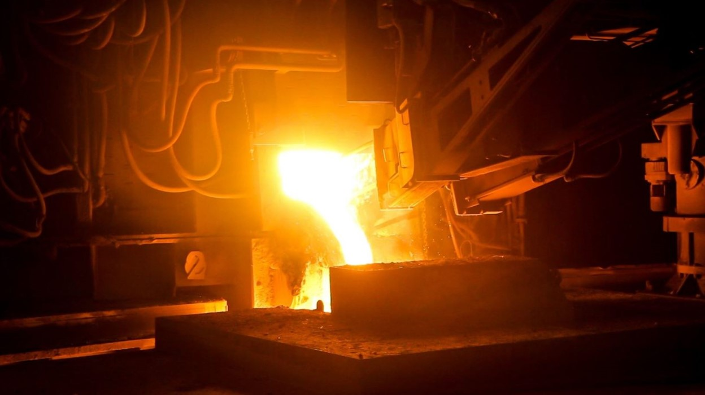
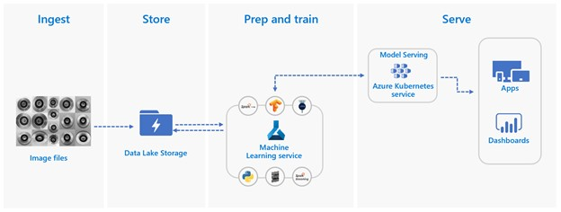

# Manufacturing-Quality-Inspection

## EXECUTIVE SUMMARY
Manufacturing is becoming automated on a broad scale. The technology enables manufacturers to affordably boost their throughput, improve quality and become nimbler as they respond to customer demands. Automation is a revolution in manufacturing quality control. It allows the companies to set certain bars or criteria for the products being manufactured. Then it also aids in real-time tracking of the manufacturing process through machine vision cameras and/or recordings.  
The core deliverable for this project is building deep learning image classification models which can automate the process of inspection for casting defects. I have produced a rest endpoint which can accept a cast image and subsequently run a tuned model to classify if the cast is acceptable or not.  

As part of this project, I have built the computer vision models in 3 different ways addressing different personas, because not all companies will have a resolute data science team.  
1.	Using Keras Tensorflow model (convolution2d) what a trained team of data scientists would do.
2.	Using Azure Machine Learning Designer (designer) which enables AI engineers and Data scientists use a drag and drop prebuilt model DenseNet (densenet). 
3.	Using Azure custom vision (custom-vision) which democratizes the process of building the computer vision model with little to no training.

## Contents
| File/folder       | Description                                |
|-------------------|--------------------------------------------|
| `notebook`        | Python Notebooks.                          |
| `data`            | images for  casting manufacturing product.                        |
| `images`          | Sample images used for documentation.      |
| `.gitignore`      | Define what to ignore at commit time.      |
| `CHANGELOG.md`    | List of changes to the sample.             |
| `CONTRIBUTING.md` | Guidelines for contributing to the sample. |
| `README.md`       | This README file.                          |
| `LICENSE`         | The license for the sample.                |

## GUIDING PRINCIPLES
The work that will be subsequently done as part of this paper will have at the very least embody the following principles (ai/responsible-ai, n.d.):  
•	Fair - AI must maximize efficiencies without destroying dignity and guard against bias.  
•	Accountable - AI must have algorithmic accountability.  
•	Transparent - AI systems must be transparent and understandable.  
•	Ethical - AI must assist humanity and be designed for intelligent privacy.  

## DATA SOURCES
For this project, the data is sourced from Kaggle. The dataset is a collection of images for  casting manufacturing product. More specifically all photos are top view of submersible pump impeller.  
The dataset contains total 7348 image data. These all are the size of (300*300) pixels grey-scaled images. In all images, augmentation already applied. There are also images of size of 512x512 grayscale. This data set is without Augmentation. This contains 519 okfront and 781 deffront impeller images.  
The data is already labelled and split. Both train and test folder contain deffront and okfront subfolders.  
train:- deffront have 3758 and okfront have 2875 images.  
test:- deffront have:- deffront have 453 and ok_front have 262 images.  

## ARCHITECTURE
Given below is the architecture that this solution is using. 

**Synopsis:** Raw data in jpeg format will be ingested into Azure Data Lake store. The raw folder in azure data lake store will be mounted as a dataset in Azure Machine Learning Services. Further featurization and model building is done in Azure Machine Learning Platform using Python code + Azure Machine Learning APIs. After the best model is selected, it is registered in Azure Container Registry and finally hosted in Azure Kubernetes Services for scoring new images.

## ACKNOWLEDGEMENTS
* I am grateful to Ravirajsinh Dabhi for compiling the data. https://www.kaggle.com/ravirajsinh45/real-life-industrial-dataset-of-casting-product
License information: https://creativecommons.org/licenses/by-nc-nd/4.0/
* Also would like to thank my Professor, Dr. Brett Werner, whose expertise was invaluable in formulating the research questions and methodology. His insightful feedbacks helped me course correct my deliverables and the structure of the lessons he has planned kept me focused and engaged.

## DISCLAIMER
This project is purely academic in nature.

## REFERENCES
ai/responsible-ai. (n.d.). Retrieved from microsoft.com: https://www.microsoft.com/en-us/ai/responsible-ai  
Bova, T. (n.d.). busin. Retrieved from gallup: http://linkis.com/www.gallup.com/busin/M4Mmc  
computer-vision. (n.d.). Retrieved from sas: https://www.sas.com/en_us/insights/analytics/computer-vision.html  
concept-automated-ml. (n.d.). Retrieved from https://docs.microsoft.com/en-us/azure: https://docs.microsoft.com/en-us/azure/machine-learning/concept-automated-ml  
convolution2d. (n.d.). Retrieved from https://keras.io: https://keras.io/api/layers/convolution_layers/convolution2d/  
custom-vision. (n.d.). Retrieved from https://docs.microsoft.com: https://docs.microsoft.com/en-us/azure/cognitive-services/custom-vision-service/overview  
deep-asteroid. (n.d.). Retrieved from open.nasa.gov: https://open.nasa.gov/innovation-space/deep-asteroid/  
densenet. (n.d.). Retrieved from arxiv.org: https://arxiv.org/abs/1608.06993  
designer. (n.d.). Retrieved from https://docs.microsoft.com: https://docs.microsoft.com/en-us/azure/machine-learning/concept-designer  
ImageDataGenerator. (n.d.). Retrieved from https://www.tensorflow.org: https://www.tensorflow.org/api_docs/python/tf/keras/preprocessing/image/ImageDataGenerator  
Keras. (n.d.). Retrieved from en.wikipedia.org: https://en.wikipedia.org/wiki/Keras  
TensorFlow. (n.d.). Retrieved from en.wikipedia.org: https://en.wikipedia.org/wiki/TensorFlow  
Transfer_learning. (n.d.). Retrieved from en.wikipedia.org: https://en.wikipedia.org/wiki/Transfer_learning  

